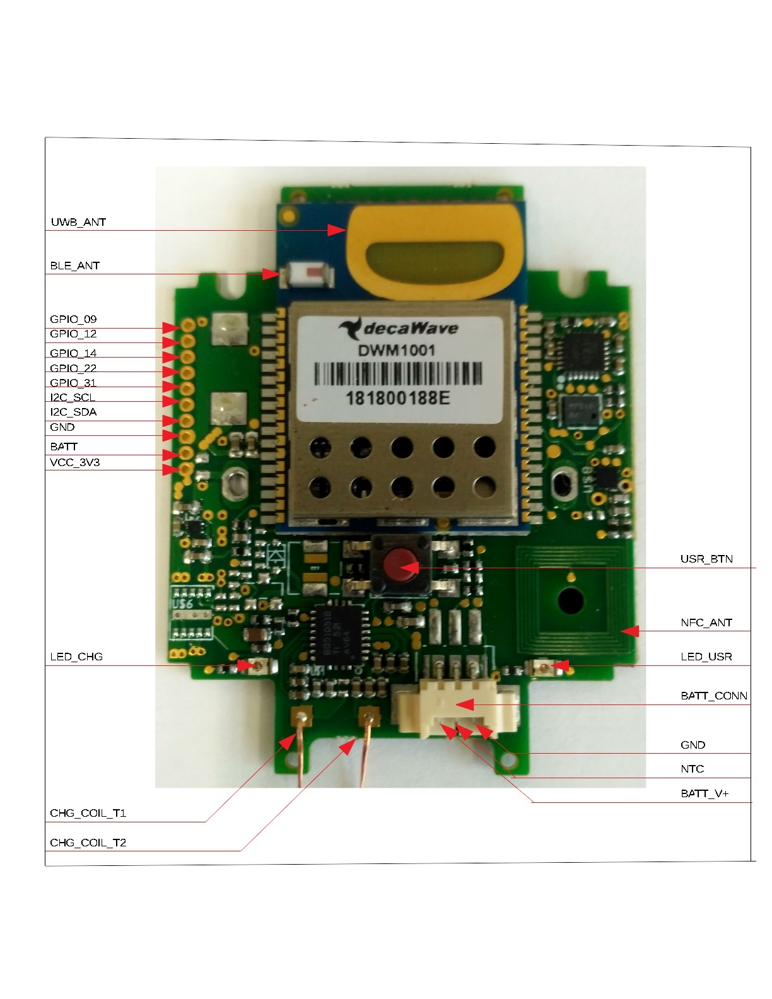
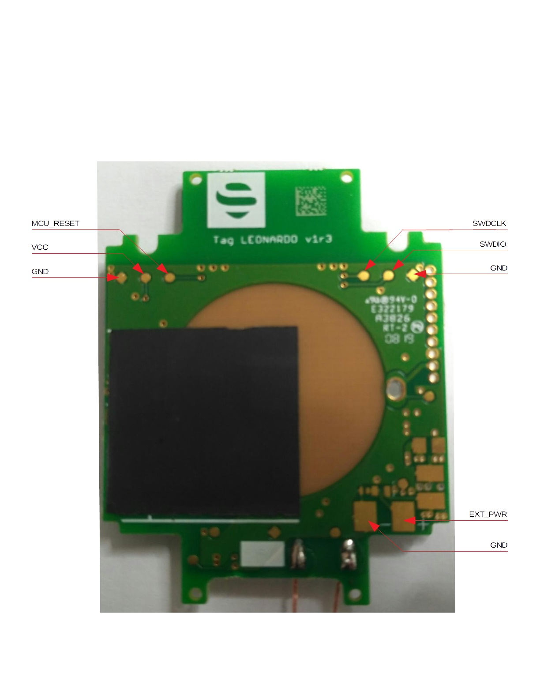

# Tag Leonardo Interfaces description

| I/O			| Description				|
| :------: 		| :-------- 	|
|**BLE_ANT**	| Bluetooth antenna                                                                                                                                                                                                                                                        |
|**GPIO_09**	| General purpose I/O pin. P0.9 on nRF                                                                                                                                                                                                                                     |
|**GPIO_12**	| General purpose I/O pin. P0.12 on nRF                                                                                                                                                                                                                                    |
|**GPIO_14**	| General purpose I/O pin. P0.14 on nRF                                                                                                                                                                                                                                    |
|**GPIO_22**	| General purpose I/O pin. P0.22 on nRF                                                                                                                                                                                                                                    |
|**GPIO_31**	| General purpose I/O pin. P0.31 on nRF                                                                                                                                                                                                                                    |
|**I2C_SCL**	| I2C bus Clock                                                                                                                                                                                                                                                            |
|**I2C_SDA**	| I2C bus Serial data signal.                                                                                                                                                                                                                                              |
|**GND**		| This pin is directly connected to the ground plane.                                                                                                                                                                                                                      |
|**BATT**		| Positive power supply voltage. The supply voltage must be in range from 3.2 V to 5.5 V.\ It must also be able to supply a peak current of 150 mA.                                                                                                                         |
|**VCC_3V3**	| VCC for supply device connected to tag. Also it can be used to supply all tag, if the BATT_V++ \and BATT are not connected. There is strongly recommended to use power supply with clean output voltage V = 3.3V. It must also be able to supply a peak current of 150 mA.|
|**VCC**		| ^                                                                                                                                                                                                                                                                        |
|**LED_CHG**	| LED indication of charging                                                                                                                                                                                                                                               |
|**CHG_COIL_T1**| Charging coil term. 1                                                                                                                                                                                                                                                    |
|**CHG_COIL_T2**| Charging coil term. 2                                                                                                                                                                                                                                                    |
|**BATT_V** 	| Positive power supply voltage. The supply voltage must be in range from 3.2 V to 5.5 V. It must also be able to supply a peak current of 150 mA.                                                                                                                         |
|**NTC** 		| Battery NTC pin.                                                                                                                                                                                                                                                         |
|**GND**		| Negative power supply input. It is directly connected to GND on the tag.                                                                                                                                                                                                 |
|**BATT_CONN**	| Battery connector. PN: 87438- 0343                                                                                                                                                                                                                                       |
|**LED_USR**	| User LED indication.                                                                                                                                                                                                                                                     |
|**NFC_ANT**	| NFC antenna                                                                                                                                                                                                                                                              |
|**USR_BTN**	| Pushbutton – see datasheet for more info about button functionality                                                                                                                                                                                                      |
|**MCU_RESET**	| MCU reset pin – active low                                                                                                                                                                                                                                               |
|**SWDIO**		| Serial Wire Debug input/output                                                                                                                                                                                                                                           |
|**SWDCLK**		| Serial Wire Debug clock                                                                                                                                                                                                                                                  |
|**EXT_PWR**	| Positive external power supply voltage. The supply voltage must be in range from 7 V to 36 V. It must also be able to supply a peak current of 150 mA @ 7 V.                                                                                                             |

